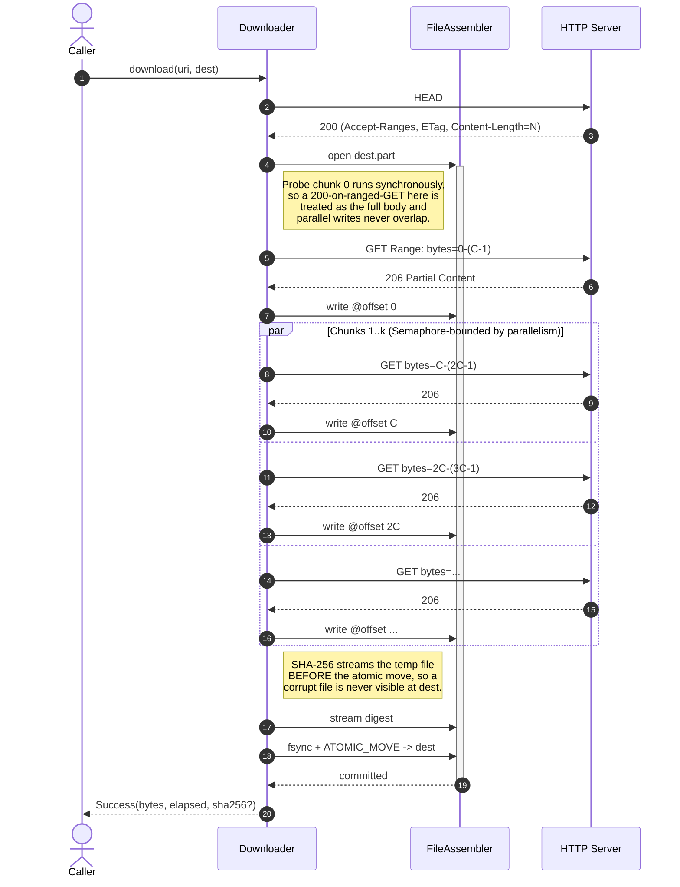

# Parallel Range-GET File Downloader

[](https://github.com/lmnst/LLM-Telemetry-PII-Validator/actions/workflows/ci.yml)

A Java 21 library and CLI for parallel, resumable, integrity-checked
HTTP file downloads, built as a data-ingestion primitive. **Every
download ends with the destination file matching a known SHA-256, or
no artifact written.** 153 unit + property tests; 120 seeded chaos
runs against 14 fault classes per GET. No runtime dependencies.

## Anatomy of a download



## Correctness guarantees

- **A probe chunk before parallel fan-out.** Servers that advertise
  `Accept-Ranges: bytes` but return `200 + full body` on a ranged GET
  would corrupt the destination if N writers each got the whole body.
  Chunk 0 runs synchronously; on `200`, we commit it as the full
  download. Parallel writes never overlap.
- **Integrity verified before the atomic move.** With `--sha256`, the
  computed digest is checked against the expected value before
  `Files.move(..., ATOMIC_MOVE)`. A corrupt file is never visible at
  the destination path; failure modes are typed (`INTEGRITY_FAILURE`,
  `RESOURCE_CHANGED`, etc.) rather than half-written artifacts.
- **Resumable via a sidecar manifest, fenced by `If-Range`.** A
  `<dest>.part.json` records URL, ETag, Content-Length, chunk size,
  and a hex bitmap of completed chunks. On retry, only missing chunks
  are re-fetched; any validator drift fails fast with
  `RESOURCE_CHANGED` rather than silently merging old and new bytes.

The 14-fault chaos suite asserts the headline invariant on every
seed: success means the destination matches the source SHA-256;
failure means a typed `DownloadError` with no leftover artifacts. See
[DESIGN.md](DESIGN.md) for the full trade-off analysis.

## Performance

64 MiB file served from `httpd:2.4` with 50 ms one-way `netem` delay,
4 MiB chunks, median of three runs:

| `--parallelism` | Median time | Throughput | Speedup |
|---:|---:|---:|---:|
| 1 (single-stream) | 2929 ms | 21.8 MiB/s | 1.00x |
| 4                 | 1298 ms | 49.3 MiB/s | 2.26x |
| 8                 |  995 ms | 64.3 MiB/s | 2.94x |
| 16                |  827 ms | 77.4 MiB/s | 3.54x |

Re-derive without Docker via `./gradlew jmh`. For a zero-RTT loopback
comparison against `curl` and `wget` (the unflattering case, framed
honestly), see [docs/COMPARISON.md](docs/COMPARISON.md).

## Quick start

```bash
./gradlew installDist
DL=build/install/parallel-downloader/bin/parallel-downloader

mkdir -p /tmp/corpus && head -c $((64 * 1024 * 1024)) /dev/urandom > /tmp/corpus/test.bin
docker run --rm -d -p 8080:80 -v /tmp/corpus:/usr/local/apache2/htdocs/ --name dl-httpd httpd:2.4

$DL --url http://localhost:8080/test.bin --out /tmp/dl.bin --report json
# {"status":"success","file":"/tmp/dl.bin","bytes":67108864,"elapsedMs":234,"chunks":8, ...}
```

`just demo` wraps this with a generated SHA-256 check and teardown.
The CLI exposes `--url`, `--out`, `--chunk-size`, `--parallelism`,
`--sha256`, `--resume`, and `--report text|json`. Exit codes are
typed per failure class; flag and exit-code reference in
[docs/USAGE.md](docs/USAGE.md).

## Public API

```
Downloader            download(URI, Path) / downloadAsync(URI, Path) / close()
DownloaderOptions     record + Builder; expectedDigest, resumeStrategy, progressListener
DownloadResult        sealed: Success | Failure
DownloadError         enum: HTTP_ERROR | IO_ERROR | SIZE_MISMATCH | INTEGRITY_FAILURE
                            | RESOURCE_CHANGED | CANCELLED | TIMEOUT | RANGES_NOT_SUPPORTED
ProgressListener      onProgress(ProgressEvent); NO_OP default
ProgressEvent         sealed: Started | ChunkCompleted | Failed | Finished
```

Full type list, default options, behavior matrix, library usage
example, and progress-listener wiring are in
[docs/USAGE.md](docs/USAGE.md).

## Further reading

- [DESIGN.md](DESIGN.md): trade-offs, resumption state machine,
  chaos invariant, what was deliberately left out.
- [docs/USAGE.md](docs/USAGE.md): full API reference, CLI flag
  semantics, library and listener examples.
- [docs/COMPARISON.md](docs/COMPARISON.md): vs curl, wget on
  zero-RTT loopback, 3 file sizes, hyperfine.
- [docs/STORY-TESTCONTAINERS-DOCKER.md](docs/STORY-TESTCONTAINERS-DOCKER.md):
  debugging episode, a silent integration-test skip on Docker 29.

## Requirements

Java 21+. Gradle wrapper included.
