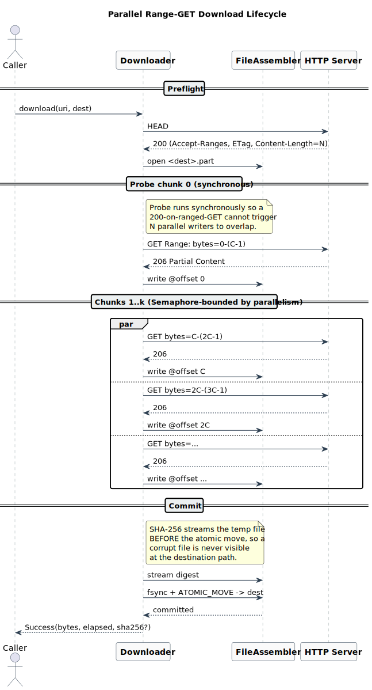

# Parallel Range-GET File Downloader

[](https://github.com/lmnst/java-parallel-downloader/actions/workflows/ci.yml)


A Java 21 library and CLI for parallel, resumable, integrity-checked
HTTP file downloads. Built as a data-ingestion primitive: every
download either ends with the destination file matching a known
SHA-256, or no artifact is written.

> Submitted to the **Data Ingestion team** at JetBrains as the
> take-home solution for the Summer 2026 internship application.

## Table of contents

1. [What this is](#what-this-is)
2. [Architecture](#architecture)
3. [Correctness pillars](#correctness-pillars)
4. [Performance](#performance)
5. [Quick start](#quick-start)
6. [Public API](#public-api)
7. [Testing strategy](#testing-strategy)
8. [Further reading](#further-reading)
9. [Requirements and build](#requirements-and-build)

## What this is

A small, dependency-free library that downloads a single HTTP
resource by issuing many concurrent ranged GET requests and
assembling the chunks into a single file. The shape is conventional;
the value is in the safety properties.

The take-home brief asked for parallel range-GET downloading with
unit tests. This implementation goes a level deeper, treating the
artifact as something that might land in an ingestion pipeline:

- A failed download leaves no half-written file at the destination.
- A succeeded download is byte-for-byte verifiable by SHA-256
  *before* the destination file appears.
- A crashed download can be resumed without re-fetching completed
  bytes, and any drift in the source resource fails fast rather than
  silently mixing old and new bytes.

These guarantees are exercised by 153 unit and property tests, plus
120 seeded chaos runs that inject 14 fault classes per HTTP GET.
The non-test runtime has zero third-party dependencies.

## Architecture

The full download lifecycle, including the synchronous probe chunk
that prevents the "lying server" failure mode and the integrity gate
that runs before the atomic move:



A PlantUML source for the diagram lives at
[`docs/architecture.puml`](docs/architecture.puml) and re-renders
with `java -jar plantuml.jar -tsvg docs/architecture.puml`.

## Correctness pillars

The library makes three load-bearing claims. Each one is enforced by
the same small piece of code, then verified by the chaos suite under
seeded fault injection.

### 1. The probe chunk prevents silent corruption

Some servers advertise `Accept-Ranges: bytes` in the HEAD response
but ignore the `Range` header on a subsequent GET, returning the
full body with status `200`. If N parallel chunks each receive the
full body and write it at their own offset, the destination file is
silently corrupted.

The mitigation is a synchronous *probe chunk* at offset 0, fetched
before any other chunks fan out. If the probe returns `200`, the
downloader treats the body as the complete download and commits it.
No parallel writes ever happened, so corruption is impossible. If
the probe returns `206`, the server's range support is confirmed
and the remaining chunks fan out.

### 2. Integrity is verified before the atomic move

When the caller passes `--sha256 <expected>` (or
`DownloaderOptions.expectedDigest(...)` in the library), the temp
file is streamed through a `MessageDigest` after the last chunk
completes and *before* `Files.move(..., ATOMIC_MOVE)`. A digest
mismatch fails with `INTEGRITY_FAILURE` and the temp file is
deleted; the destination path is never touched.

This means a corrupt file is never visible at the destination, even
transiently. A monitoring process tailing the output directory will
never observe a wrong-bytes file under the right name.

### 3. Resumption is fenced by `If-Range`

When `RESUME_IF_VALID` mode is set, the downloader writes a
`<dest>.part.json` sidecar manifest after each chunk's successful
write and fsync. The manifest records the URL, ETag (or
`Last-Modified`), `Content-Length`, chunk size, and a hex bitmap of
completed chunks.

On retry, only missing chunks are re-fetched, and every ranged GET
carries `If-Range: <validator>`. A `200` response on a ranged GET
with `If-Range` set means the server has replaced the resource. The
adapter surfaces this and the downloader fails fast with
`RESOURCE_CHANGED` rather than silently merging old and new bytes.

## Performance

A 64 MiB file served from `httpd:2.4` with 50 ms one-way `netem`
delay, 4 MiB chunks, median of three runs. Re-derive without Docker
via `./gradlew jmh`.

| `--parallelism` | Median time | Throughput | Speedup |
|---:|---:|---:|---:|
| 1 (single-stream) | 2929 ms | 21.8 MiB/s | 1.00x |
| 4                 | 1298 ms | 49.3 MiB/s | 2.26x |
| 8                 |  995 ms | 64.3 MiB/s | 2.94x |
| 16                |  827 ms | 77.4 MiB/s | 3.54x |

The curve is the load-bearing claim, not the absolute numbers.
Speedup compounds until the BDP of the link is filled, then the
remaining wins come from request pipelining rather than added
parallelism.

For a zero-RTT loopback comparison against `curl` and `wget` (the
unflattering case for any parallel downloader, framed honestly), see
[`docs/COMPARISON.md`](docs/COMPARISON.md).

## Quick start

```bash
./gradlew installDist
DL=build/install/parallel-downloader/bin/parallel-downloader

mkdir -p /tmp/corpus
head -c $((64 * 1024 * 1024)) /dev/urandom > /tmp/corpus/test.bin

docker run --rm -d -p 8080:80 \
    -v /tmp/corpus:/usr/local/apache2/htdocs/ \
    --name dl-httpd httpd:2.4

$DL --url http://localhost:8080/test.bin --out /tmp/dl.bin --report json
```

The structured report:

```json
{
  "status": "success",
  "file": "/tmp/dl.bin",
  "bytes": 67108864,
  "elapsedMs": 234,
  "chunks": 8
}
```

The wrapper script `just demo` runs this end to end with a generated
SHA-256 check and full teardown. The CLI exposes `--url`, `--out`,
`--chunk-size`, `--parallelism`, `--sha256`, `--resume`, and
`--report text|json`. Every failure mode has its own exit code; the
full reference is in [`docs/USAGE.md`](docs/USAGE.md).

## Public API

```java
try (Downloader dl = Downloader.create(DownloaderOptions.builder()
        .parallelism(8)
        .chunkSize(8 * 1024 * 1024)
        .expectedDigest(ExpectedDigest.sha256(hex))
        .resumeStrategy(ResumeStrategy.RESUME_IF_VALID)
        .build())) {

    DownloadResult result = dl.download(uri, dest);
    switch (result) {
        case DownloadResult.Success s  -> System.out.println(s.bytes());
        case DownloadResult.Failure f  -> System.err.println(f.error());
    }
}
```

The full type list:

| Type | Role |
|---|---|
| `Downloader` | Entry point: `download` / `downloadAsync` / `close` |
| `DownloaderOptions` | Record + builder. Holds `expectedDigest`, `resumeStrategy`, `progressListener`. |
| `DownloadResult` | Sealed: `Success` or `Failure`. |
| `DownloadError` | Enum: `HTTP_ERROR`, `IO_ERROR`, `SIZE_MISMATCH`, `INTEGRITY_FAILURE`, `RESOURCE_CHANGED`, `CANCELLED`, `TIMEOUT`, `RANGES_NOT_SUPPORTED`. |
| `ProgressListener` | SPI; `NO_OP` is the default. |
| `ProgressEvent` | Sealed: `Started`, `ChunkCompleted`, `Failed`, `Finished`. |

Library usage and progress-listener wiring are in
[`docs/USAGE.md`](docs/USAGE.md).

## Testing strategy

| Layer | Count | What it covers |
|---|---:|---|
| Unit | 153 | Range planner, manifest, file assembler, retry policy, JSON encoder, CLI parser. |
| Property | (in unit) | `RangePlanner` covers `totalBytes` exactly across random sizes. |
| Integration | 4 | Real `httpd:2.4` via Testcontainers; full lifecycle through CLI binary. |
| Chaos | 120 seeds | 14 fault classes per HTTP GET; invariants asserted on every seed. |

The chaos invariant: *Success implies the destination matches the
source SHA-256; Failure implies a typed `DownloadError` with no
leftover artifacts at the destination.* No "best-effort" middle
ground is permitted. See [`DESIGN.md`](DESIGN.md) for the full
trade-off analysis.

## Further reading

- **[`DESIGN.md`](DESIGN.md)**: trade-offs, the resumption state
  machine, the chaos invariant, and what was deliberately left out.
- **[`docs/USAGE.md`](docs/USAGE.md)**: full API reference, CLI flag
  semantics, library and listener examples, exit-code table.
- **[`docs/COMPARISON.md`](docs/COMPARISON.md)**: vs `curl`, `wget`
  on zero-RTT loopback, three file sizes, hyperfine.
- **[`docs/STORY-TESTCONTAINERS-DOCKER.md`](docs/STORY-TESTCONTAINERS-DOCKER.md)**:
  a debugging episode about a silent integration-test skip on Docker
  Engine 29.
- **[`docs/architecture.puml`](docs/architecture.puml)**: PlantUML
  source for the lifecycle diagram above.

## Requirements and build

- Java 21 or newer (the wrapper expects `JAVA_HOME` or `java` on
  `PATH`).
- Gradle 8.13+ (wrapper included; no system Gradle required).

```bash
./gradlew check        # all tests except chaos
./gradlew test -PchaosTests   # chaos suite (~30 s on a laptop)
./gradlew installDist  # produce CLI launcher under build/install/
./gradlew javadoc      # publishable API docs
```

CI runs the full check on Linux, macOS, and Windows on every push.
